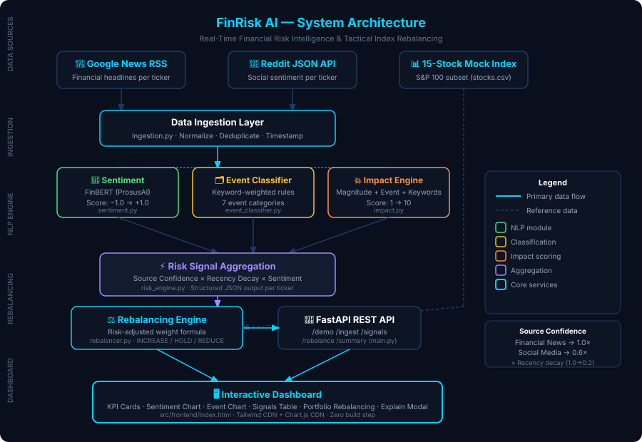

# FinRisk AI — Real-Time Financial Risk Intelligence & Tactical Index Rebalancing
### S&P Global & Crisil Campus Hackathon 2026

**Candidate Name:** Keerthana Kanumuri  
**College / Campus:** VIT AP UNIVERSITY 
**Demo Video Link:** [YouTube Unlisted — add after recording]  
**Slide Deck:** [`docs/presentation.pdf`](docs/presentation.pdf) *(upload PDF before submission)*  

---

## 1. Project Overview / Problem Statement & Approach

Financial markets generate millions of unstructured text signals every day — news articles, earnings reports, social media posts — yet converting this flood of information into timely, actionable portfolio decisions remains a manual, slow, and error-prone process. Risk analysts spend hours reading and interpreting text before any portfolio adjustment can be made.

**FinRisk AI** solves this end-to-end. It ingests real-time financial news (Google News RSS) and social media posts (Reddit public API), runs each item through a domain-specific NLP pipeline built on **FinBERT** (a financial-domain BERT model), and outputs three structured risk signals per item: a sentiment score (−1.0 to +1.0), an event classification (Geopolitical, Macroeconomic, Credit Event, Merger/Acquisition, Product Launch, Earnings, General Market), and an impact score (1–10). These signals are then aggregated — weighted by source confidence and recency decay — and fed into a **tactical index rebalancing engine** that automatically adjusts the portfolio weights of a 15-stock mock S&P 100 index.

The result is a complete, explainable pipeline: from raw unstructured text to a live dashboard showing exactly why each stock weight was increased, held, or reduced — with no manual analyst intervention required.

---

## 2. Architecture & Tech Stack

### Architecture Diagram



### Data Flow

```
Google News RSS  ──┐
                   ├──► Data Ingestion ──► NLP Risk Engine ──► Risk Aggregation
Reddit JSON API  ──┘         │                  │                     │
                             │         ┌────────┴────────┐            │
                             │    FinBERT          Event+Impact        │
                             │    Sentiment        Classifier          │
                             │                                         ▼
15-Stock Index CSV ─────────────────────────────────────► Rebalancing Engine
                                                                       │
                                                                       ▼
                                                           FastAPI REST API
                                                                       │
                                                                       ▼
                                                         Interactive Dashboard
```

### Tech Stack

| Layer | Technology |
|---|---|
| Backend API | Python 3.13, FastAPI 0.115, Uvicorn |
| NLP / Sentiment | FinBERT (`ProsusAI/finbert`), HuggingFace Transformers, PyTorch |
| Data Processing | Pandas, NumPy |
| Data Ingestion | Feedparser (RSS), Requests (Reddit API) |
| Frontend | Vanilla JS, Tailwind CSS (CDN), Chart.js (CDN) |
| Deployment | Local (no cloud required for demo) |

---

## 3. Dataset Used

| Dataset | Source | Type |
|---|---|---|
| Financial news headlines | Google News RSS (free, public) | Live / real-time |
| Social media posts | Reddit public JSON API (`/search.json`) | Live / real-time |
| Mock stock index | `data/stocks.csv` — 15 S&P 100 tickers | Synthetic / created for demo |
| Demo signals | `data/demo_signals.json` — 30 pre-built signals | Synthetic / created for demo |

**Assumptions:**
- The 15-stock index uses equal base weights (6.67% each) as a starting point
- Reddit posts are treated as lower-confidence signals (0.6×) versus financial news (1.0×)
- Signals older than 24 hours receive a 0.2× recency multiplier
- The rebalancing formula is simplified for hackathon scope; it does not include transaction costs or liquidity constraints
- No proprietary, confidential, or licensed datasets are used

---

## 4. Quickstart & Installation

**Runtime:** Python 3.10+ on Windows (tested on Python 3.13)

```bash
# 1. Clone the repository
git clone https://github.com/keerthanakanumuri/S-P_Global_-_Crisil_Campus_Hackathon-.git
cd S-P_Global_-_Crisil_Campus_Hackathon-

# 2. Create and activate virtual environment
cd src/backend
python -m venv venv

# Windows
venv\Scripts\activate

# 3. Install dependencies
pip install -r requirements.txt

# 4. Start the backend server
uvicorn main:app --host 127.0.0.1 --port 8000

# 5. Open the dashboard (no build step required)
# Open src/frontend/index.html in any browser
```

**Windows one-click launcher (alternative):**
```
Double-click  start.bat  in the project root
Then open     src/frontend/index.html  in your browser
```

**API endpoints available at `http://127.0.0.1:8000`:**

| Endpoint | Description |
|---|---|
| `GET /` | Health check |
| `GET /demo` | Load 30 pre-built demo signals (offline fallback) |
| `GET /ingest` | Fetch live news + Reddit, run full NLP pipeline |
| `GET /signals` | Return latest processed risk signals |
| `GET /rebalance` | Return rebalanced portfolio weights |
| `GET /summary` | Aggregate market statistics |
| `GET /docs` | Auto-generated Swagger UI |

---

## 5. Key Results & Domain Impact

### Sample Output — Risk Signal

```json
{
  "ticker":           "NVDA",
  "company":          "NVIDIA",
  "source":           "Financial News",
  "sentiment_label":  "negative",
  "sentiment_score":  -0.88,
  "event_type":       "Geopolitical",
  "impact_score":     9,
  "risk_level":       "Critical",
  "source_confidence": 1.0
}
```

### Rebalancing Results (demo data, 30 signals, 15 stocks)

| Ticker | Base Weight | New Weight | Action |
|---|---|---|---|
| MSFT | 6.67% | 8.73% | ▲ INCREASE |
| AMZN | 6.67% | 8.78% | ▲ INCREASE |
| GOOGL | 6.67% | 8.92% | ▲ INCREASE |
| TSLA | 6.67% | 8.70% | ▲ INCREASE |
| NVDA | 6.67% | 5.59% | ▼ REDUCE |
| META | 6.67% | 3.75% | ▼ REDUCE |
| JPM | 6.67% | 4.71% | ▼ REDUCE |
| JNJ | 6.67% | 4.34% | ▼ REDUCE |
| PG | 6.67% | 6.37% | — HOLD |

Portfolio weights sum to 100% ✓ · All weights within [2%, 12%] constraints ✓

### Domain Impact

- **Speed:** Converts a multi-hour analyst workflow (read → classify → decide) into a sub-second automated pipeline
- **Consistency:** Removes human bias from sentiment interpretation using a financial-domain NLP model
- **Explainability:** Every portfolio action comes with a plain-language reason (event type, sentiment score, confidence, recency)
- **Resilience:** Source confidence weighting reduces the influence of unreliable social media signals on portfolio decisions
- **Scalability:** The same pipeline works for any number of tickers with no structural changes

---

## Project Structure

```
S-P_Global_-_Crisil_Campus_Hackathon-/
├── README.md                        ← This file
├── LICENSE                          ← MIT License
├── requirements.txt                 ← Root-level alias (points to src/backend)
├── start.bat                        ← Windows one-click launcher
├── .gitignore
│
├── src/
│   ├── backend/
│   │   ├── main.py                  ← FastAPI application (5 endpoints)
│   │   ├── requirements.txt         ← Python dependencies
│   │   ├── data/
│   │   │   └── stocks.csv           ← 15-stock mock index
│   │   └── services/
│   │       ├── ingestion.py         ← Google News RSS + Reddit ingestion
│   │       ├── sentiment.py         ← FinBERT sentiment analysis
│   │       ├── event_classifier.py  ← 7-category event classification
│   │       ├── impact.py            ← Impact score calculation (1–10)
│   │       ├── risk_engine.py       ← Unified NLP pipeline orchestrator
│   │       └── rebalancer.py        ← Tactical index rebalancing engine
│   └── frontend/
│       └── index.html               ← Complete dashboard (CDN only, no build)
│
├── data/
│   └── demo_signals.json            ← 30 pre-built signals (offline fallback)
│
└── docs/
    ├── architecture.svg             ← System architecture diagram
    └── presentation.pdf             ← 7-slide deck (add before submission)
```
